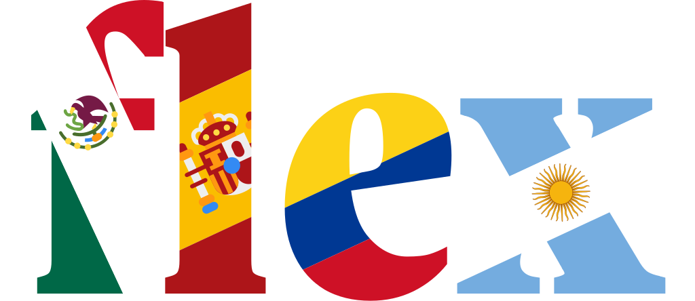

## [Open Greek](https://github.com/open-greek)

Open source Greek NLP, corpora, and typography, developed under the [Open Greek](https://github.com/open-greek) organization on [GitHub](https://github.com/open-greek) and [Hugging Face](https://huggingface.co/open-greek).

<table>
<tr>
<td width="50%" valign="top">

### [dilemma](https://github.com/open-greek/dilemma)

Diachronic Greek NLP package spanning Ancient (Classical, Homeric, Hellenistic), Medieval/Byzantine (vernacular and literary), and Modern Greek (Demotic and Katharevousa). A four-layer lemmatizer that falls back in priority order, from a 12.5M-form lookup (the largest compiled for Greek) through rule-based stripping and dialect normalization to a character-level transformer for unseen forms, plus a POS tagger and dependency parser.

</td>
<td width="50%" valign="top">

### [open-greek-corpus](https://github.com/open-greek/open-greek-corpus)

An open, comprehensive corpus of ancient Greek literature: openly-licensed digital editions, plus state-of-the-art OCR of public-domain editions for the texts the open corpora don't yet cover. A public, freely-usable counterpart to the major subscription corpora.

</td>
</tr>
<tr>
<td width="50%" valign="top">

### [lemma](https://github.com/open-greek/lemma)

Free Modern Greek-English dictionary for Kindle e-readers. 31K headwords, 568K inflected-form lookups, built from Wiktionary data. Generator written in Rust.

</td>
<td width="50%" valign="top">

### [dragoman](https://huggingface.co/open-greek/dragoman)

Diachronic word-alignment model for Ancient Greek, Modern Greek, and English. Fine-tuned from [UGARIT/grc-alignment](https://huggingface.co/UGARIT/grc-alignment) on Iliad parallel text with contrastive alignment training. Powers the word-tap alignment in [Iliad Aligned](https://iliadaligned.com).

</td>
</tr>
<tr>
<td width="50%" valign="top">

### [greek-majuscule-fonts](https://github.com/open-greek/greek-majuscule-fonts)

Five Greek majuscule fonts, each in the scribal hand of a different Oxyrhynchus papyrus (P.Oxy. 2162, 2174, 2181, 2256, 2506). Type uppercase Greek and the letters render in the actual hand of an ancient scribe. Ships in OTF, TTF, and WOFF2.

</td>
</tr>
</table>

## Public Repos

<table>
<tr>
<td width="50%" valign="top">

### [kindling](https://github.com/ciscoriordan/kindling)

The missing Kindle toolkit. Dictionaries, books, and comics, built as a single static Rust binary with no dependencies. Reverse-engineered MOBI generator that replaces Amazon's deprecated *kindlegen*: ~7,000x faster on a heavily-inflected Modern Greek dictionary, and ~40x faster on a 2M-entry French dictionary.

</td>
<td width="50%" valign="top">

### [storescreens-cli](https://github.com/ciscoriordan/storescreens-cli)

Capture App Store screenshots across every required device size in one command. Runs your UI tests on multiple simulators in parallel, organizes output by device and locale, and auto-detects which App Store size each simulator maps to. iPhone, iPad, Apple Watch, and Mac.

</td>
</tr>
<tr>
<td width="50%" valign="top">

### [svg-flags](https://github.com/ciscoriordan/svg-flags)

Clean, Xcode-compatible SVG flags with official colors in multiple shapes: circle, square, full-size, and simplified full-size. Fixes three issues with *circle-flags*: no Xcode support, circles only, and a reduced 11-color palette.

</td>
</tr>
</table>

## iOS Apps

<table>
<tr>
<td width="50%" valign="top">

### [Klisy](https://klisy.app)

Greek conjugations and declensions for iOS. The 10,000 most common Modern and Ancient (Attic) Greek lemmas and their inflected forms, scheduled with FSRS-6 spaced repetition. [klisy.app](https://klisy.app)

</td>
<td width="50%" valign="top">

### [Tonos](https://tonospolytonic.com)

A polytonic Greek keyboard for iOS 18+. Dedicated diacritic row, plus autocorrect and typeahead powered by [dilemma](https://github.com/open-greek/dilemma). Supports Classical, Koine, Byzantine, and Katharevousa orthographies. [tonospolytonic.com](https://tonospolytonic.com)

</td>
</tr>
<tr>
<td width="50%" valign="top">

### [Iliad Aligned](https://iliadaligned.com)

iOS app presenting Homer's *Iliad* in parallel columns: Ancient Greek, Modern Greek (Polylas-Riordan), and English (Murray-Riordan). Tap any word for morphological analysis and dictionary definitions from Cunliffe, LSJ, and Wiktionary. [iliadaligned.com](https://iliadaligned.com)

</td>
<td width="50%" valign="top">

### [CCWCalc](https://ccwcalc.com)

iOS app and web reference for concealed-carry laws and reciprocity across 50 states, DC, PR, GU, USVI, AS, CNMI, 365 Indian reservations, 169 military installations, and 176 on-base hotels. [ccwcalc.com](https://ccwcalc.com)

</td>
</tr>
<tr>
<td width="50%" valign="top">

### [Flex](https://flexlanguage.app)

Spanish verb conjugation app with full voseo coverage, FSRS spaced repetition, and GPU-accelerated speech recognition. 5,064 verbs, every tense and mood, free. [flexlanguage.app](https://flexlanguage.app)

</td>
</tr>
</table>
